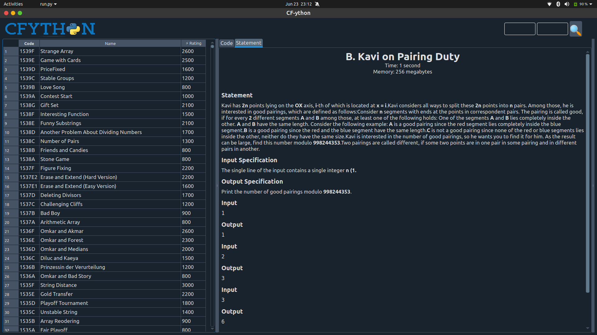
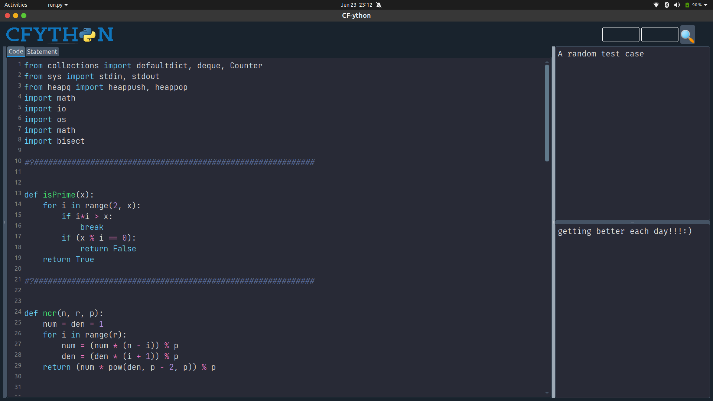
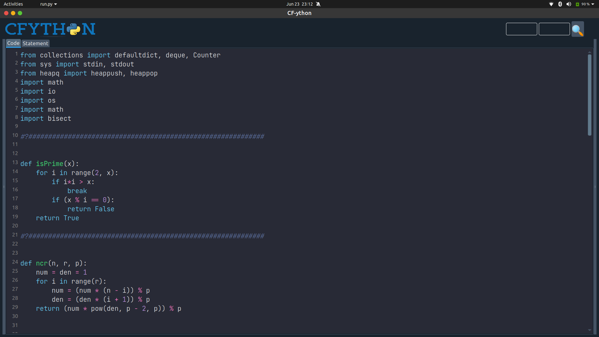

<br />
<p align="center">
  <a href="https://github.com/aneeketMangal/CF-ython">
    
  </a>
    <p align = "center">
    <a href="https://github.com/aneeketMangal/CF-ython"><strong>Explore the docs »</strong></a>
    <br />
    <a href="https://github.com/aneeketMangal/issues">Report Bug</a>
    ·
    <a href="https://github.com/aneeketMangal/issues">Request Feature</a>
  </p>
</p>

### About The Project

<p align = "center">
<div>
<a href="https://github.com/github_username/repo_name">
    
</div>

</a>
</p>

It is codeforces practice tool that integrates a dedicated python text editor with codeforces environment. This way you can see the problem statement while editing your code. The editor comes with features like auto indent, commenting, syntax highlighting and other features like copying the selected line.

### Screen Shots
<p align = "center">
<div>
<a href="https://github.com/github_username/repo_name">
    
</div>

</a>
</p>
<p align = "center">
<div>
<a href="https://github.com/github_username/repo_name">
    
</div>

</a>
</p>
<p align = "center">
<div>
<a href="https://github.com/github_username/repo_name">
    
</div>

</a>
</p>

### Modules used (major)

- PyQt5
- bs4
- requests


### Installation

1. Clone the repo
   ```sh
   git clone https://github.com/aneeketMangal/CF-ython.git
   ```
2. Install the given requirements by
    ```sh
    pip3 install -r requiremts.txt
    ```
### Instructions and walkthrough
* The application window is divided into three panes
  * **Problem selector:** Displays the list of codeforces problems based on selected filters.
  * **Editor/Problem Viewer:** Contains the editor and displays problem statement.
  * **Input/Output:** YOu may enter input test case in first pane and once you run the code output will be visible in output pane.
* Commands
  * ```Ctrl+Shift+B```: To run the code.
  * ```Ctrl+\```: To comment/uncomment selected code.
  * ```Ctrl+S```: To save the code.
  * ```Ctrl+Shift+P```: To copy selected line down.

## Contributing
* You can improve text editor by adding accessibility features such as in popular text editors. (PyQt5)
* You can improve parsing of scraped data from codeforces website. (bs4)
* You can implement support for languages other than python such as C++ or Java.

1. Fork the Project
2. Create your Feature Branch (`git checkout -b feature/AmazingFeature`)
3. Commit your Changes (`git commit -m 'Add some AmazingFeature'`)
4. Push to the Branch (`git push origin feature/AmazingFeature`)
5. Open a Pull Request
